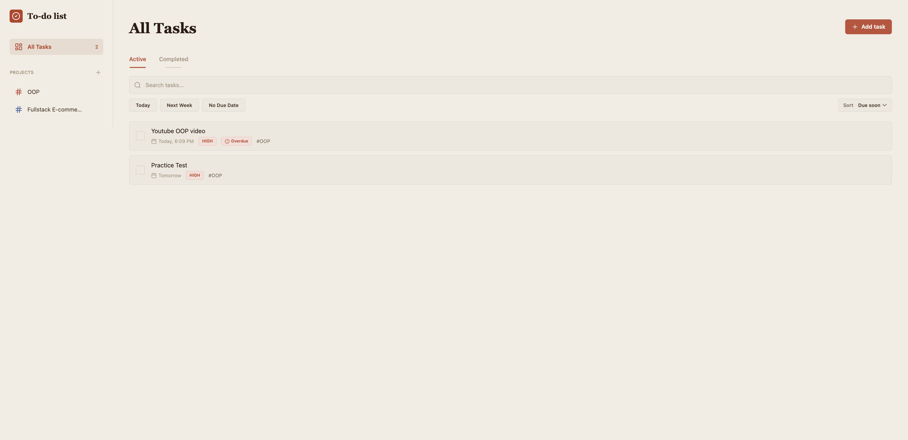
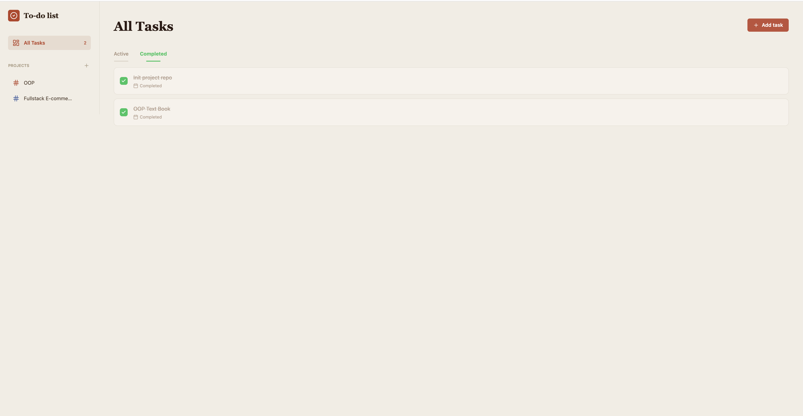
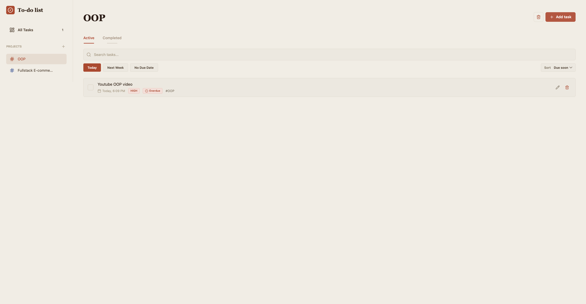
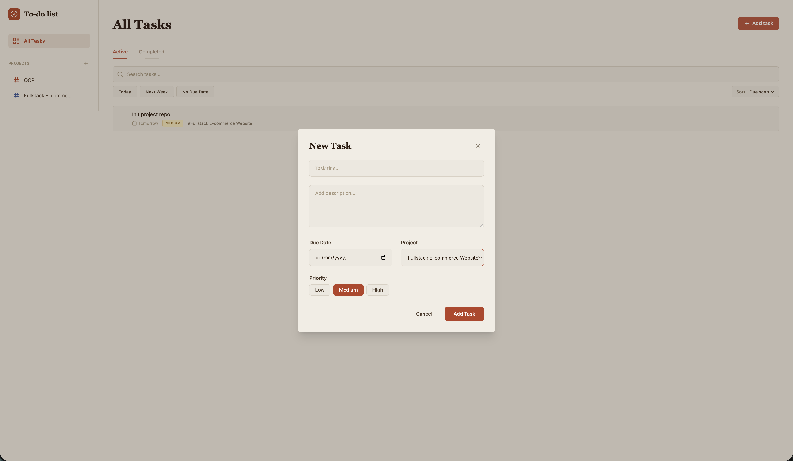

# To-do List Full-stack Assignment

This project is a full-stack task management app. It includes a polished Next.js interface, a Spring Boot REST API, PostgreSQL persistence, Docker Compose, and backend unit tests.

## Architecture

- Backend API: Java 17, Spring Boot, Spring Data JPA, Spring Validation.
- Database: PostgreSQL 15.
- Frontend: Next.js, TypeScript, Tailwind CSS.
- DevOps: Docker and Docker Compose.
- Testing: JUnit 5 and Mockito.

## Features

- View active and completed tasks in a polished workspace layout.
- Create, edit, complete, and delete tasks.
- Search tasks and filter by status or due-date chips.
- Assign tasks to projects from the sidebar.
- Create projects with color and description metadata.
- Store task priority, due date, project, and completion state through the API.
- Validate invalid form data on the backend and show field errors in the UI.

## Screenshots

### Active Tasks



### Completed Tasks



### Project Filter



### New Task Modal



## Quick Start With Docker Compose

From the project root, run:

```bash
docker-compose up --build
```

After startup:

- Frontend: `http://localhost:3000`
- Backend REST API: `http://localhost:8080/api/v1/tasks`
- Projects REST API: `http://localhost:8080/api/v1/projects`
- PostgreSQL: `localhost:5432`

## Run Backend Tests

```bash
cd backend
mvn test
```

## Run Frontend Locally

```bash
cd frontend
npm install
npm run dev
```

## Check Frontend

Run linting and a production build:

```bash
cd frontend
npm run lint
npm run build
```

## Scope And Tradeoffs

- The project focuses on Todo List CRUD behavior, validation, filtering, pagination, Dockerized local setup, and backend unit/slice tests.
- CORS is limited to local frontend development origins such as `http://localhost:*` and `http://127.0.0.1:*`.
- Database schema management uses Spring JPA `ddl-auto=update` to keep the assignment simple to run locally. A production service should use migrations such as Flyway or Liquibase.
- Frontend verification is limited to linting and production build checks. End-to-end browser automation is intentionally out of scope for this submission.

## Main API

- `GET /api/v1/tasks?search=&isCompleted=&page=0&size=10`
- `POST /api/v1/tasks` with `title`, `description`, optional `projectId`, optional `priority` (`LOW`, `MEDIUM`, `HIGH`), and optional `dueDate`
- `PUT /api/v1/tasks/{id}` with `title`, `description`, optional `projectId`, optional `priority`, optional `dueDate`, and `isCompleted`
- `PATCH /api/v1/tasks/{id}/toggle`
- `DELETE /api/v1/tasks/{id}`
- `GET /api/v1/projects`
- `POST /api/v1/projects` with `name`, optional `description`, and optional `color`
- `PUT /api/v1/projects/{id}` with `name`, optional `description`, and optional `color`
- `DELETE /api/v1/projects/{id}`
